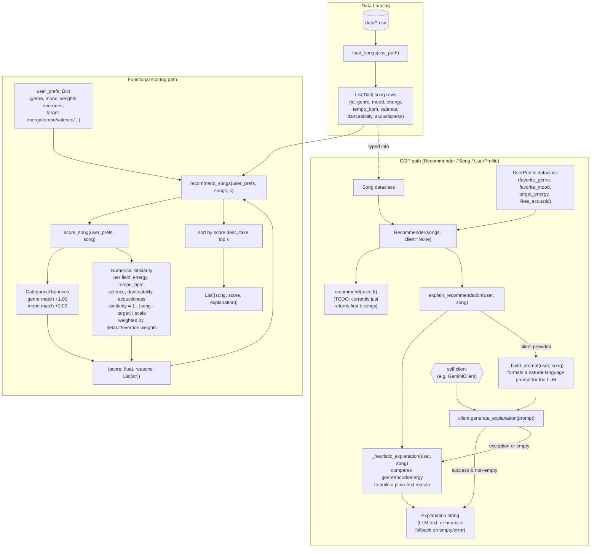

```mermaid
flowchart TD
subgraph Data["Data Loading"]
        CSV[("data/*.csv")]
        load_songs["load_songs(csv_path)"]
        SongDicts["List[Dict] song rows\n(id, genre, mood, energy,\ntempo_bpm, valence,\ndanceability, acousticness)"]
        CSV --> load_songs --> SongDicts
    end

    subgraph Scoring["Functional scoring path"]
        UserPrefs["user_prefs: Dict\n(genre, mood, weights overrides,\ntarget energy/tempo/valence/...)"]
        recommend_songs["recommend_songs(user_prefs, songs, k)"]
        score_song["score_song(user_prefs, song)"]
        CatBonus["Categorical bonuses\ngenre match +1.00\nmood match +2.00"]
        NumSim["Numerical similarity\nper field: energy, tempo_bpm,\nvalence, danceability, acousticness\nsimilarity = 1 - |song - target| / scale\nweighted by default/override weights"]
        ScoreReasons["(score: float, reasons: List[str])"]
        SortTopK["sort by score desc, take top k"]
        RankedResults["List[(song, score, explanation)]"]

        UserPrefs --> recommend_songs
        SongDicts --> recommend_songs
        recommend_songs --> score_song
        score_song --> CatBonus --> ScoreReasons
        score_song --> NumSim --> ScoreReasons
        ScoreReasons --> recommend_songs
        recommend_songs --> SortTopK --> RankedResults
    end

    subgraph OOP["OOP path (Recommender / Song / UserProfile)"]
        Song["Song dataclass"]
        UserProfile["UserProfile dataclass\n(favorite_genre, favorite_mood,\ntarget_energy, likes_acoustic)"]
        Recommender["Recommender(songs, client=None)"]
        recommend["recommend(user, k)\n[TODO: currently just\nreturns first k songs]"]
        explain["explain_recommendation(user, song)"]
        heuristic["_heuristic_explanation(user, song)\ncompares genre/mood/energy\nto build a plain-text reason"]
        build_prompt["_build_prompt(user, song)\nformats a natural-language\nprompt for the LLM"]
        client{{"self.client\n(e.g. GeminiClient)"}}
        LLMExplain["client.generate_explanation(prompt)"]
        FinalExplanation["Explanation string\n(LLM text, or heuristic\nfallback on empty/error)"]

        Song --> Recommender
        UserProfile --> Recommender
        Recommender --> recommend
        Recommender --> explain
        explain --> heuristic
        explain -->|client provided| build_prompt --> LLMExplain
        client --> LLMExplain
        LLMExplain -->|success & non-empty| FinalExplanation
        LLMExplain -->|exception or empty| heuristic
        heuristic --> FinalExplanation
    end

    SongDicts -. "typed into" .-> Song
```
